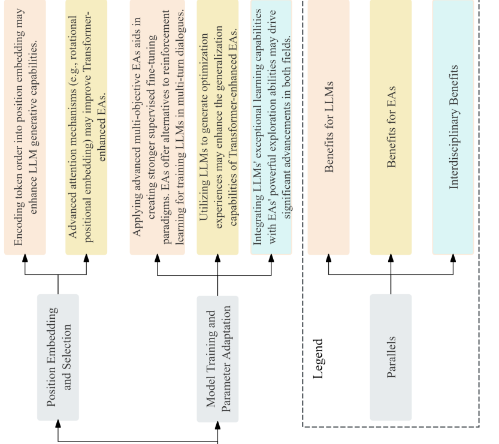
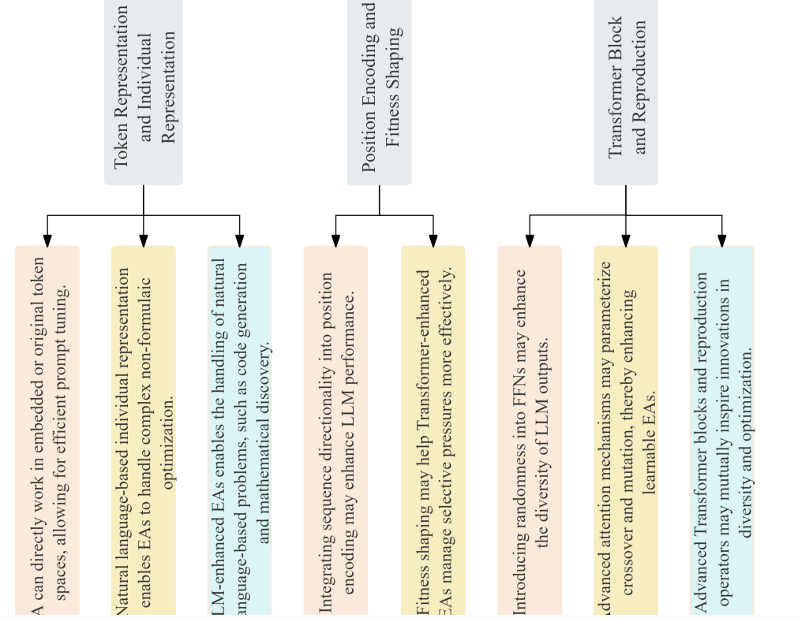
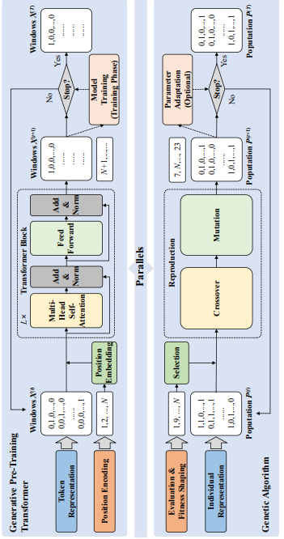
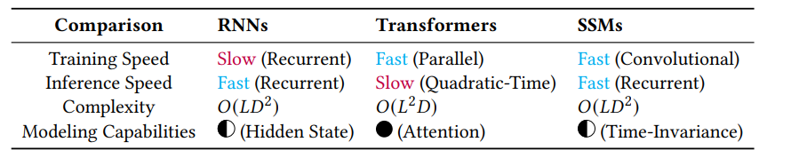
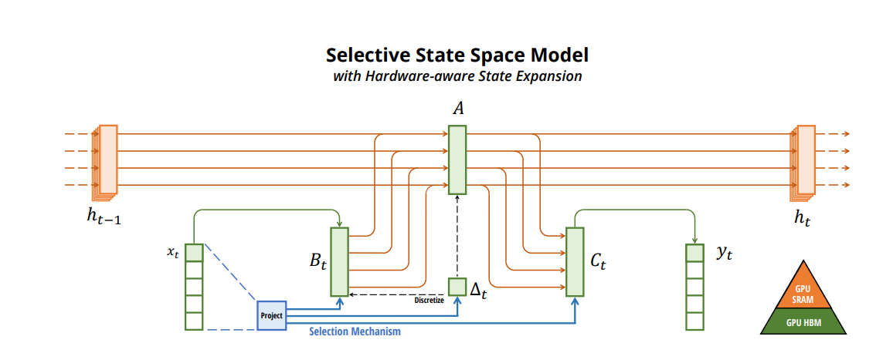
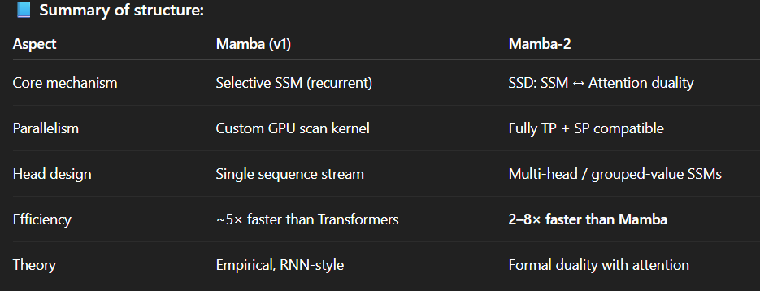

# https://sakana.ai/evolutionary-model-merge/

- The core research focus of Sakana AI is in applying nature-inspired ideas, such as evolution and collective intelligence, to create new foundation models.
- We want to create the machinery to automatically generate foundation models for us!
- We introduce Evolutionary Model Merge, a general method that uses evolutionary techniques to efficiently discover the best ways to combine different models from the vast ocean of different open-source models with diverse capabilities. 
- evolve 3 powerful foundation models for Japan
- In fact, the current Open LLM Leaderboard is dominated by merged models.
- We believe evolutionary algorithms, inspired by natural selection, can unlock more effective merging solutions. These algorithms can explore a vast space of possibilities, discovering novel and unintuitive combinations that traditional methods and human intuition might miss. 
- new foundation models can also be created by applying evolution to find combinations of different parts of different foundation models. In this work, we apply this concept of evolutionary design to evolve new foundation models. Through successive generations (even up to hundreds), evolution will also produce new foundation models naturally selected to perform really well at a particular application domain specified by the user.
- Evolutionary Model Merge, a general evolutionary method to discover the best ways to combine different models. The method combines two different approaches: (1) Merging models in the Data Flow Space (Layers), and (2) Merging models in the Parameter Space (Weights).
- Both Data Flow Space and Parameter Space approaches can also be combined together to evolve new foundation models.
- Our approach operates in both parameter space (weights) and data flow space (layers), allowing for optimization beyond just the weights of the individual models.

# https://arxiv.org/abs/2406.12208
-  This paper examines the
approach of integrating multiple models from
diverse training scenarios into a unified model.
- We propose a
knowledge fusion method named Evolver, inspired by evolutionary algorithms, which does
not need further training or additional training
data. Specifically, our method involves aggregating the weights of different language models into a population and subsequently generating offspring models through mutation and
crossover operations.
- Therefore, our objective is to integrate knowledge from models trained
in different scenarios to enhance the model’s performance in cross-domain or cross-task scenarios
(Wortsman et al., 2022b), without the need for further training or extra training data.

- Emotional classification tasks
- Fusion of tasks
- Generalization performance

# https://arxiv.org/abs/2505.15741
(i) Bidirectional Perspective on LLM–EC Synergy: This paper presents a comprehensive, two-way investigation of how LLMs can enhance EC through operator generation, tuning, and metaheuristic design,
and how EC can improve LLMs via prompt engineering, architecture optimization, and hyperparameter
tuning.

(ii) Structured Taxonomy and Framework: We suggest a novel taxonomy that systematically categorizes
methods, roles, and integration strategies, covering topics such as LLM-generated metaheuristics, surrogate modeling, co-evolutionary systems, and explainable EC, offering readers a unified framework to
understand this emerging field.

(iii) Survey of Emerging Co-Adaptive Paradigms: This work introduces and analyzes new co-adaptive paradigms
where LLMs and EC evolve together, including co-evolutionary frameworks, human-in-the-loop systems, and pattern-guided evolutionary search, which are underexplored in previous surveys.

(iv) Cross-Domain Application Landscape: We review and map the application of LLM-EC synergies across
diverse domains such as scientific modeling, optimization, automated design, and decision-support systems, highlighting practical use cases and deployment insights.

(v) Identification of Research Gaps and Future Challenges: The survey outlines unresolved challenges, such
as scalability, explainability, and benchmark design, and provides a forward-looking research agenda to
guide future interdisciplinary work in this field.

2.1. EC in Prompt Engineering

Unfortunately, crafting effective prompts usually demands substantial human effort, domain expertise, and
iterative trial-and-error; 
The integration of EC with prompt engineering has led to substantial advancements in optimizing LLMs.
EC’s search strategies systematically refine prompts, delivering gains across diverse tasks.

Expanding the integration of EC and LLMs further, Guo et al. [32] developed EvoPrompt, a unique
framework where language models themselves serve as evolutionary operators. EvoPrompt enables LLMs
to propose new prompt candidates through operations analogous to genetic crossover and mutation, with EC
subsequently selecting prompts based on improved development-set performance.
Other frameworks are presented in the paper. Explore if want to dive in into prompt optimization

2.5. Evolutionary Hyperparameter Tuning for LLMs

 Manually tuning these parameters is often a laborious, intuition-driven process. EC offers a compelling alternative (see Table 5 for some examples) for automating this process. Esta tabela é boa para ver exemplos de que estrategias EC foram usadas para que tarefas.

2.5.1. Evolutionary Architecture Optimization for LLMs

EC can effectively search the space of neural architectures by representing architectures as individuals, evaluating their
performance (fitness), and applying evolutionary operators (selection, mutation, crossover) to generate and refine new candidate architectures iteratively. Table 8 presents a summary of evolutionary approaches for neural
architectural search. BOA TABELA PARA MAIS STATE-OF-THE-ART WORKS.

2.6 Future work and limitations

Future research has numerous potential directions to address current limitations and unlock further possibilities, including efficiency improvements through more accurate, cheaper, and scalable surrogate models or
training-free fitness evaluation techniques, as well as reducing the computational overhead of integrating LLMs
into optimization. Scalability enhancements are needed to design EC and representations capable of handling
larger search spaces from future LLM generations. Improved representations should explore sophisticated
encodings for complex LLM architectures and hyperparameters to enhance evolutionary search.
Automated algorithm design (AutoML/AutoAD) could extend EC and
LLMs to self-improving optimization systems.
Finally, the theory lags behind practice: little is known about sample complexity, convergence
guarantees, or how an LLM’s “learning strategy” co-evolves with an EA’s “search strategy.”
Addressing these EC-specific obstacles will require a mix of engineering and theory. Promising directions include fast, training-free fitness surrogates that widen feasible population sizes; geometry-aware mutation and
crossover operators for continuous embeddings; legality-preserving encodings and grammar-guided search for
ultra-large transformer variants; and hybrid schemes in which back-propagation performs local refinement
while EC supplies global exploration. A firmer theoretical footing—for example, sample-efficiency bounds or
criteria that predict when EC + LLM synergy outperforms either component alone—would guide algorithm
design and resource allocation. Progress along these lines could make EC a practical, scalable tool for prompt
and architecture optimisation in the next generation of LLMs.

# https://arxiv.org/abs/2401.10510
Thanks to their gradient-free nature, evolutionary algorithms (EAs) are employed to
fine-tune LLMs in black-box scenarios, where they rely solely on forward propagation
and do not require access to internal model gradients [15]. This makes EAs a practical
choice for such settings.
This paper draws conceptual analogies between the primary characteristics of LLMs and EAs, emphasizing their common mechanisms.

#### Parallels

Token representation can be regarded as an individual representation, which satisfies collective and uniqueness.
EAs using token representations can operate directly within embedded or
original token spaces to find high-quality input prompts

Inspired by fitness shaping, the integration of sequence directionality
into position encoding emerges as a noteworthy research direction

Attention does not explicitly model
token positions. Similarly, crossover inherently does not consider individual fitness.
The attention and selection matrices play analogous roles: one determines token feature combinations, while the other governs parent genetic combinations. The attention
matrix is parameterized based on token embeddings, while the selection matrix is
heuristically built on individual relationships.

Inspired
by the directionality of fitness considered in selection, introducing token order directly
into position embedding may enhance the generative capabilities of LLMs.

From a macro perspective, the parallels between LLMs and EAs provide a conceptual framework that can inspire the development of artificial agents
capable of learning from established knowledge while continuously exploring new
knowledge

This paper also shows a little the idea of co-evolution between EA and Transformers, where both can leave in a simbiotic way.

In contrast, evolutionary prompt tuning [15] and
evolutionary self-tuning [77–81] primarily focus on modifying the model’s input to
enhance performance on specific tasks, requiring access to no internal information.
These evolutionary fine-tuning techniques in black-box scenarios are gaining attention
for their low cost, as detailed in Tables 2 and 3.
As shown in Fig. 4, evolutionary prompt tuning enhances model generation quality in few-shot or zero-shot settings by searching input prompts.

# https://www.amazon.science/publications/structural-pruning-of-large-language-models-via-neural-architecture-search

The paper tackles the problem of making large language models like BERT more efficient at inference by framing structured pruning as a neural architecture search (NAS) task. Instead of unstructured pruning, which produces sparse weights that are hard to exploit in practice, the authors focus on removing entire attention heads, neurons, or even layers, which is hardware-friendly but hard to design manually. They treat the pre-trained model as a super-network, where sub-networks are defined by binary masks over heads and neurons. This setup allows pruning to be cast as a multi-objective optimization problem, trading off model size against task performance.

The super-network is trained with weight sharing so all sub-networks reuse the same parameters. To stabilize training, they use the “sandwich rule” (always training smallest, largest, and random sub-networks) together with in-place knowledge distillation, aligning sub-network outputs with the super-network’s. After training, sub-networks can be evaluated cheaply without retraining, and the best ones are chosen along the Pareto front.

They experiment with different search spaces of varying granularity and different search strategies, finding that smaller, more constrained spaces actually work better under limited compute budgets. Surprisingly, a simple local search method outperformed more complex evolutionary algorithms. On GLUE tasks with BERT-base, they showed that the method can prune around 50% of parameters without accuracy loss.

In conclusion, the approach demonstrates that structured pruning via NAS is an effective way to compress LLMs. It highlights the value of constrained search spaces, simple search strategies, and weight-sharing with distillation. Limitations include the need to fine-tune per task and the focus on encoder models, leaving autoregressive architectures and further compression methods like quantization for future work.

# https://arxiv.org/abs/2408.01129

In this survey, we therefore conduct an in-depth investigation of
recent Mamba-associated studies, covering three main aspects: the advancements of Mamba-based models, the techniques of adapting
Mamba to diverse data, and the applications where Mamba can excel. 

Transformers dominate AI but are limited by quadratic time complexity due to the attention mechanism.
State Space Models (SSMs), inspired by control theory, efficiently capture long-range dependencies with linear complexity.
Mamba combines SSMs’ efficiency with Transformers’ expressive modeling, making it suitable for long-sequence tasks in text, vision, and time series.

What mamba introduces :

HiPPO-based memory initialization for long-term dependencies.
Selection mechanism that makes SSMs content-aware by adapting parameters to input.
Hardware-aware computation (parallel associative scan + memory recomputation) for efficient GPU execution.
Mamba offers a computationally efficient alternative to Transformers, maintaining strong modeling capacity with near-linear scalability.

Mamba, an emerging deep learning architecture, has demonstrated remarkable success across diverse domains, such
as language generation, image classification, recommendation, and drug discovery, owing to its powerful modeling
capabilities and computational efficiency.

# https://arxiv.org/abs/2312.00752
This is the oficial paper of the creators of Mamba. It explains how it works and all the theory behind, etc.

Transformers are powerful but limited by quadratic time and memory complexity due to self-attention

Core ideas:

1. Selectivity: Mamba allows the model to selectively retain or forget information based on the current input.

- Achieved by making SSM parameters functions of the input.
- Enables content-based reasoning (something previous SSMs lacked).

2. Hardware-aware design:

- The model is computed recurrently (not via convolutions).
- Implements a parallel scan algorithm and memory recomputation to maximize GPU efficiency.
- Achieves 5× faster inference and linear training complexity.

3. Simplified Architecture:

- Combines the SSM and MLP blocks into a single unified block → the Mamba block.
- No attention, no separate MLPs.
- Stacks these blocks homogeneously.

Mamba achieves Transformer-level or superior performance across multiple domains:
Language, DNA and audio modeling; syntetic tasks

Mamba = Selectivity (Transformer-level reasoning) + State-space efficiency (linear time)
It is a scalable, hardware-efficient backbone for foundation models across modalities — text, DNA, audio, and more.

# https://arxiv.org/pdf/2405.21060
This is the paper of the creators of Mamba-2. It formally introduces Mamba-2. I will just focus on what did they improved and whats diferent.

1. Conceptual Shift: From Empirical SSM to Theoretical Duality
- Mamba (2023): A Selective State Space Model (SSM) — an efficient RNN-like model using content-dependent parameters (A, B, C) to replace attention while maintaining linear complexity.
- Mamba-2 (2024): Built on the new Structured State Space Duality (SSD) framework — proving that Transformers and SSMs are mathematically dual under structured matrix decompositions.

In short: Mamba-1 was empirical and hardware-driven; Mamba-2 provides a unifying theoretical bridge linking SSMs and attention.

2. Mamba-2 introduces the Structured State Space Duality (SSD) algorithm:

Reinterprets SSMs as structured matrix multiplications on semiseparable matrices.

Allows computation through a block-decomposed hybrid method combining linear (SSM) and quadratic (attention) paths.

At sequence length 16K, Mamba-2 is 6× faster than softmax attention (FlashAttention-2 level performance) while retaining linear scalability.

Mamba-2 = Mamba + Duality + Hardware optimization.

It mathematically unifies SSMs and attention, turning Mamba from an “efficient RNN-like alternative” into a theoretically grounded, hardware-optimized, and Transformer-compatible sequence model.
Some parts of this papper I skipped for it was a deeper dive into mamba-2, wich i dont think its necessary for now