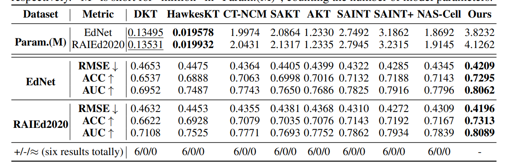

# https://sakana.ai/evolutionary-model-merge/

- The core research focus of Sakana AI is in applying nature-inspired ideas, such as evolution and collective intelligence, to create new foundation models.
- We want to create the machinery to automatically generate foundation models for us!
- We introduce Evolutionary Model Merge, a general method that uses evolutionary techniques to efficiently discover the best ways to combine different models from the vast ocean of different open-source models with diverse capabilities. 
- evolve 3 powerful foundation models for Japan
- In fact, the current Open LLM Leaderboard is dominated by merged models.
- We believe evolutionary algorithms, inspired by natural selection, can unlock more effective merging solutions. These algorithms can explore a vast space of possibilities, discovering novel and unintuitive combinations that traditional methods and human intuition might miss. 
- new foundation models can also be created by applying evolution to find combinations of different parts of different foundation models. In this work, we apply this concept of evolutionary design to evolve new foundation models. Through successive generations (even up to hundreds), evolution will also produce new foundation models naturally selected to perform really well at a particular application domain specified by the user.
- Evolutionary Model Merge, a general evolutionary method to discover the best ways to combine different models. The method combines two different approaches: (1) Merging models in the Data Flow Space (Layers), and (2) Merging models in the Parameter Space (Weights).
- Both Data Flow Space and Parameter Space approaches can also be combined together to evolve new foundation models.
- Our approach operates in both parameter space (weights) and data flow space (layers), allowing for optimization beyond just the weights of the individual models.

# https://arxiv.org/abs/2406.12208
-  This paper examines the
approach of integrating multiple models from
diverse training scenarios into a unified model.
- We propose a
knowledge fusion method named Evolver, inspired by evolutionary algorithms, which does
not need further training or additional training
data. Specifically, our method involves aggregating the weights of different language models into a population and subsequently generating offspring models through mutation and
crossover operations.
- Therefore, our objective is to integrate knowledge from models trained
in different scenarios to enhance the model’s performance in cross-domain or cross-task scenarios
(Wortsman et al., 2022b), without the need for further training or extra training data.

- Emotional classification tasks
- Fusion of tasks
- Generalization performance

# https://arxiv.org/abs/2505.15741
(i) Bidirectional Perspective on LLM–EC Synergy: This paper presents a comprehensive, two-way investigation of how LLMs can enhance EC through operator generation, tuning, and metaheuristic design,
and how EC can improve LLMs via prompt engineering, architecture optimization, and hyperparameter
tuning.

(ii) Structured Taxonomy and Framework: We suggest a novel taxonomy that systematically categorizes
methods, roles, and integration strategies, covering topics such as LLM-generated metaheuristics, surrogate modeling, co-evolutionary systems, and explainable EC, offering readers a unified framework to
understand this emerging field.

(iii) Survey of Emerging Co-Adaptive Paradigms: This work introduces and analyzes new co-adaptive paradigms
where LLMs and EC evolve together, including co-evolutionary frameworks, human-in-the-loop systems, and pattern-guided evolutionary search, which are underexplored in previous surveys.

(iv) Cross-Domain Application Landscape: We review and map the application of LLM-EC synergies across
diverse domains such as scientific modeling, optimization, automated design, and decision-support systems, highlighting practical use cases and deployment insights.

(v) Identification of Research Gaps and Future Challenges: The survey outlines unresolved challenges, such
as scalability, explainability, and benchmark design, and provides a forward-looking research agenda to
guide future interdisciplinary work in this field.

2.1. EC in Prompt Engineering

Unfortunately, crafting effective prompts usually demands substantial human effort, domain expertise, and
iterative trial-and-error; 
The integration of EC with prompt engineering has led to substantial advancements in optimizing LLMs.
EC’s search strategies systematically refine prompts, delivering gains across diverse tasks.

Expanding the integration of EC and LLMs further, Guo et al. [32] developed EvoPrompt, a unique
framework where language models themselves serve as evolutionary operators. EvoPrompt enables LLMs
to propose new prompt candidates through operations analogous to genetic crossover and mutation, with EC
subsequently selecting prompts based on improved development-set performance.
Other frameworks are presented in the paper. Explore if want to dive in into prompt optimization

2.5. Evolutionary Hyperparameter Tuning for LLMs

 Manually tuning these parameters is often a laborious, intuition-driven process. EC offers a compelling alternative (see Table 5 for some examples) for automating this process. Esta tabela é boa para ver exemplos de que estrategias EC foram usadas para que tarefas.

2.5.1. Evolutionary Architecture Optimization for LLMs

EC can effectively search the space of neural architectures by representing architectures as individuals, evaluating their
performance (fitness), and applying evolutionary operators (selection, mutation, crossover) to generate and refine new candidate architectures iteratively. Table 8 presents a summary of evolutionary approaches for neural
architectural search. BOA TABELA PARA MAIS STATE-OF-THE-ART WORKS.

2.6 Future work and limitations

Future research has numerous potential directions to address current limitations and unlock further possibilities, including efficiency improvements through more accurate, cheaper, and scalable surrogate models or
training-free fitness evaluation techniques, as well as reducing the computational overhead of integrating LLMs
into optimization. Scalability enhancements are needed to design EC and representations capable of handling
larger search spaces from future LLM generations. Improved representations should explore sophisticated
encodings for complex LLM architectures and hyperparameters to enhance evolutionary search.
Automated algorithm design (AutoML/AutoAD) could extend EC and
LLMs to self-improving optimization systems.
Finally, the theory lags behind practice: little is known about sample complexity, convergence
guarantees, or how an LLM’s “learning strategy” co-evolves with an EA’s “search strategy.”
Addressing these EC-specific obstacles will require a mix of engineering and theory. Promising directions include fast, training-free fitness surrogates that widen feasible population sizes; geometry-aware mutation and
crossover operators for continuous embeddings; legality-preserving encodings and grammar-guided search for
ultra-large transformer variants; and hybrid schemes in which back-propagation performs local refinement
while EC supplies global exploration. A firmer theoretical footing—for example, sample-efficiency bounds or
criteria that predict when EC + LLM synergy outperforms either component alone—would guide algorithm
design and resource allocation. Progress along these lines could make EC a practical, scalable tool for prompt
and architecture optimisation in the next generation of LLMs.

# https://arxiv.org/abs/2401.10510
Thanks to their gradient-free nature, evolutionary algorithms (EAs) are employed to
fine-tune LLMs in black-box scenarios, where they rely solely on forward propagation
and do not require access to internal model gradients [15]. This makes EAs a practical
choice for such settings.
This paper draws conceptual analogies between the primary characteristics of LLMs and EAs, emphasizing their common mechanisms.

#### Parallels

Token representation can be regarded as an individual representation, which satisfies collective and uniqueness.
EAs using token representations can operate directly within embedded or
original token spaces to find high-quality input prompts

Inspired by fitness shaping, the integration of sequence directionality
into position encoding emerges as a noteworthy research direction

Attention does not explicitly model
token positions. Similarly, crossover inherently does not consider individual fitness.
The attention and selection matrices play analogous roles: one determines token feature combinations, while the other governs parent genetic combinations. The attention
matrix is parameterized based on token embeddings, while the selection matrix is
heuristically built on individual relationships.

Inspired
by the directionality of fitness considered in selection, introducing token order directly
into position embedding may enhance the generative capabilities of LLMs.

From a macro perspective, the parallels between LLMs and EAs provide a conceptual framework that can inspire the development of artificial agents
capable of learning from established knowledge while continuously exploring new
knowledge

This paper also shows a little the idea of co-evolution between EA and Transformers, where both can leave in a simbiotic way.

In contrast, evolutionary prompt tuning [15] and
evolutionary self-tuning [77–81] primarily focus on modifying the model’s input to
enhance performance on specific tasks, requiring access to no internal information.
These evolutionary fine-tuning techniques in black-box scenarios are gaining attention
for their low cost, as detailed in Tables 2 and 3.
As shown in Fig. 4, evolutionary prompt tuning enhances model generation quality in few-shot or zero-shot settings by searching input prompts.

# https://www.amazon.science/publications/structural-pruning-of-large-language-models-via-neural-architecture-search

The paper tackles the problem of making large language models like BERT more efficient at inference by framing structured pruning as a neural architecture search (NAS) task. Instead of unstructured pruning, which produces sparse weights that are hard to exploit in practice, the authors focus on removing entire attention heads, neurons, or even layers, which is hardware-friendly but hard to design manually. They treat the pre-trained model as a super-network, where sub-networks are defined by binary masks over heads and neurons. This setup allows pruning to be cast as a multi-objective optimization problem, trading off model size against task performance.

The super-network is trained with weight sharing so all sub-networks reuse the same parameters. To stabilize training, they use the “sandwich rule” (always training smallest, largest, and random sub-networks) together with in-place knowledge distillation, aligning sub-network outputs with the super-network’s. After training, sub-networks can be evaluated cheaply without retraining, and the best ones are chosen along the Pareto front.

They experiment with different search spaces of varying granularity and different search strategies, finding that smaller, more constrained spaces actually work better under limited compute budgets. Surprisingly, a simple local search method outperformed more complex evolutionary algorithms. On GLUE tasks with BERT-base, they showed that the method can prune around 50% of parameters without accuracy loss.

In conclusion, the approach demonstrates that structured pruning via NAS is an effective way to compress LLMs. It highlights the value of constrained search spaces, simple search strategies, and weight-sharing with distillation. Limitations include the need to fine-tune per task and the focus on encoder models, leaving autoregressive architectures and further compression methods like quantization for future work.

# https://arxiv.org/abs/2408.01129 - Mamba

In this survey, we therefore conduct an in-depth investigation of
recent Mamba-associated studies, covering three main aspects: the advancements of Mamba-based models, the techniques of adapting
Mamba to diverse data, and the applications where Mamba can excel. 

Transformers dominate AI but are limited by quadratic time complexity due to the attention mechanism.
State Space Models (SSMs), inspired by control theory, efficiently capture long-range dependencies with linear complexity.
Mamba combines SSMs’ efficiency with Transformers’ expressive modeling, making it suitable for long-sequence tasks in text, vision, and time series.

What mamba introduces :

HiPPO-based memory initialization for long-term dependencies.
Selection mechanism that makes SSMs content-aware by adapting parameters to input.
Hardware-aware computation (parallel associative scan + memory recomputation) for efficient GPU execution.
Mamba offers a computationally efficient alternative to Transformers, maintaining strong modeling capacity with near-linear scalability.

Mamba, an emerging deep learning architecture, has demonstrated remarkable success across diverse domains, such
as language generation, image classification, recommendation, and drug discovery, owing to its powerful modeling
capabilities and computational efficiency.

# https://arxiv.org/abs/2312.00752 - Mamba
This is the oficial paper of the creators of Mamba. It explains how it works and all the theory behind, etc.

Transformers are powerful but limited by quadratic time and memory complexity due to self-attention

Core ideas:

1. Selectivity: Mamba allows the model to selectively retain or forget information based on the current input.

- Achieved by making SSM parameters functions of the input.
- Enables content-based reasoning (something previous SSMs lacked).

2. Hardware-aware design:

- The model is computed recurrently (not via convolutions).
- Implements a parallel scan algorithm and memory recomputation to maximize GPU efficiency.
- Achieves 5× faster inference and linear training complexity.

3. Simplified Architecture:

- Combines the SSM and MLP blocks into a single unified block → the Mamba block.
- No attention, no separate MLPs.
- Stacks these blocks homogeneously.

Mamba achieves Transformer-level or superior performance across multiple domains:
Language, DNA and audio modeling; syntetic tasks

Mamba = Selectivity (Transformer-level reasoning) + State-space efficiency (linear time)
It is a scalable, hardware-efficient backbone for foundation models across modalities — text, DNA, audio, and more.

# https://arxiv.org/pdf/2405.21060 - Mamba-2
This is the paper of the creators of Mamba-2. It formally introduces Mamba-2. I will just focus on what did they improved and whats diferent.

1. Conceptual Shift: From Empirical SSM to Theoretical Duality
- Mamba (2023): A Selective State Space Model (SSM) — an efficient RNN-like model using content-dependent parameters (A, B, C) to replace attention while maintaining linear complexity.
- Mamba-2 (2024): Built on the new Structured State Space Duality (SSD) framework — proving that Transformers and SSMs are mathematically dual under structured matrix decompositions.

In short: Mamba-1 was empirical and hardware-driven; Mamba-2 provides a unifying theoretical bridge linking SSMs and attention.

2. Mamba-2 introduces the Structured State Space Duality (SSD) algorithm:

Reinterprets SSMs as structured matrix multiplications on semiseparable matrices.

Allows computation through a block-decomposed hybrid method combining linear (SSM) and quadratic (attention) paths.

At sequence length 16K, Mamba-2 is 6× faster than softmax attention (FlashAttention-2 level performance) while retaining linear scalability.

| Aspect         | Mamba (v1)                   | Mamba-2                         |
| -------------- | ---------------------------- | ------------------------------- |
| Core mechanism | Selective SSM (recurrent)    | SSD: SSM ↔ Attention duality    |
| Parallelism    | Custom GPU scan kernel       | Fully TP + SP compatible        |
| Head design    | Single sequence stream       | Multi-head / grouped-value SSMs |
| Efficiency     | ~5× faster than Transformers | 2–8× faster than Mamba      |
| Theory         | Empirical, RNN-style         | Formal duality with attention   |

Mamba-2 = Mamba + Duality + Hardware optimization.

It mathematically unifies SSMs and attention, turning Mamba from an “efficient RNN-like alternative” into a theoretically grounded, hardware-optimized, and Transformer-compatible sequence model.
Some parts of this papper I skipped for it was a deeper dive into mamba-2, wich i dont think its necessary for now.

# https://openreview.net/forum?id=C3t6GMPnC5 - Mamba
The paper investigates whether Mamba, a new state-space model (SSM) that has outperformed Transformers on some benchmarks, can also perform downstream learning effectively — including:

In-Context Learning (ICL)

Mixed-Precision Fine-Tuning (MPFT)

Parameter-Efficient Fine-Tuning (PEFT, e.g., LoRA)

| Capability                     | Transformers     | Mamba (Pretrained)   | Mamba (Fine-tuned) |
| ------------------------------ | ---------------- | -------------------- | ------------------ |
| ICL improvement (vs zero-shot) | 100%             | 38%                  | 81.5%          |
| Training speed                 | Baseline         | +115% (2.15× faster) |                    |
| Memory usage                   | Baseline         | −65.5% per token     |                    |
| Precision stability            | FP16/BF16 stable | FP16/BF16 stable     |                    |

Mamba’s recurrent structure is not fragile under mixed precision.

When fine-tuned efficiently, Mamba SSMs can nearly match Transformer downstream performance.

MPFT + PEFT make Mamba faster and more memory-efficient, opening the door to training larger models (≥7B params).

# https://arxiv.org/abs/2407.19832 - ML-Mamba

The paper introduces ML-Mamba, a multimodal large language model (MLLM) built on the Mamba-2 architecture — a state-space model (SSM) that scales linearly with sequence length.
Unlike traditional Transformer-based MLLMs (which have quadratic complexity), ML-Mamba aims to achieve faster inference and reduced computation while maintaining strong multimodal understanding.

1. Visual Encoder:
- Combines DINOv2 and SigLIP to extract rich spatial and semantic image features.
- This dual-encoder design balances detailed visual cues and high-level semantics.

2. Multimodal Connector (MSC – Mamba-2 Scan Connector):
- A novel connector that fuses visual and textual modalities using:
    - Mamba-2 Visual Selective Scanning (MVSS): Applies 2D scanning to image features.
    - SwiGLU Module: Improves nonlinear feature extraction.

3. Mamba-2 Language Model:
- Serves as the LLM backbone, replacing Transformers (e.g., LLaMA).
- It models sequences efficiently via SSM dynamics.

4. MLP Projector:
- Maps processed visual embeddings into the language model’s input space.

| Model               | Backbone    | Params   | VQAv2     | GQA       | TextVQA  | POPE     | VizWiz    | VSR      |
| ------------------- | ----------- | -------- | --------- | --------- | -------- | -------- | --------- | -------- |
| LLaVA-1.5 7B        | Vicuna      | 7B       | 78.5      | 62.0      | 58.2     | 85.9     | 50.0      | -        |
| VL-Mamba            | Mamba       | 2.8B     | 76.6      | 56.2      | 48.9     | 84.4     | -         | -        |
| ML-Mamba (ours) | Mamba-2 | 2.7B | 75.26 | 60.68 | 52.2 | 88.3 | 45.17 | 51.5 |

| Model             | Tokens/s | Total Time (s) |
| ----------------- | -------- | -------------- |
| TinyLLaVA (Phi-2) | 38       | 6.45           |
| MobileVLM v2      | 50       | 5.15           |
| ML-Mamba      | 171  | 1.47       |

ML-Mamba successfully applies the Mamba-2 State Space Model to multimodal learning, offering:
- Comparable accuracy to Transformer-based models
- Much faster inference
- Fewer parameters and lower computational cost

It highlights the potential of SSMs as a viable alternative to Transformers for large-scale multimodal AI.

# https://ojs.aaai.org/index.php/AAAI/article/view/33131 - Cobra

Cobra introduces a Transformer-free multi-modal large language model (MLLM) that leverages the Mamba state-space model (SSM) as its backbone to achieve:
- Linear-time inference
- Low computational cost
- Competitive multimodal understanding

It replaces traditional Transformer-based LLMs (like LLaMA or Phi) with pre-trained Mamba models, aiming to maintain strong reasoning performance while drastically improving inference efficiency.

1. Vision Encoder:
- Combines DINOv2 and SigLIP features for complementary spatial and semantic representation.
- Converts an image into patch tokens (e.g., 729 tokens for 384×384 images).

2. Projector:
- Maps visual embeddings into the same latent space as text tokens.
- Implemented using either a multi-layer perceptron (MLP) or a lightweight downsample projector (LDPv2).

3. Mamba LLM Backbone:
- Based on Mamba-2.8B or Mamba-7B, trained autoregressively.
- Provides linear computational complexity with constant memory usage, unlike Transformers’ quadratic scaling.

4. Training Setup:
- Fine-tuned on a 1.2M-sample multimodal dataset combining LLaVA v1.5, LVIS-Instruct-4V, and LRV-Instruct.
- Trained for 2 epochs using AdamW optimizer, cosine learning rate decay, and mixed precision on 8×A100 GPUs.

| Model                       | Params   | VQA-v2   | GQA      | VizWiz   | TextVQA  | VSR      | POPE     |
| --------------------------- | -------- | -------- | -------- | -------- | -------- | -------- | -------- |
| LLaVA v1.5 (7B)             | 7B       | 78.5     | 62.0     | 50.0     | 58.2     | 51.5     | 85.9     |
| Cobra-3.5B (Mamba-2.8B) | 3.5B | 77.8     | 62.3     | 49.7     | 58.2     | 58.4 | 88.4 |
| Cobra-8B (Mamba-7B)     | 7.8B | 79.2 | 63.9 | 56.2 | 59.5 | 62.9 | 87.6 |

| Model          | Backbone       | Params   | Tokens/s  | Time (s) |
| -------------- | -------------- | -------- | --------- | -------- |
| MoE-LLaVA      | Phi-2          | 5.3B     | 20.3      | 12.6     |
| LLaVA-Phi      | Phi-2          | 3.1B     | 40.9      | 6.3      |
| MobileVLM v2   | MobileLLaMA    | 3.1B     | 49.5      | 5.2      |
| Cobra-3.5B | Mamba-2.8B | 3.5B | 166.5 | 1.5  |

3×–4× faster inference than the most optimized Transformer MLLMs.

Maintains accuracy despite processing more visual tokens.

Principal contributions:
- Cobra — the first Mamba-based multimodal large language model, offering a Transformer-free alternative.
- Linear scalability and constant memory inference, ideal for real-time and edge applications.
- Enhanced reasoning and anti-hallucination via improved visual-textual fusion.
- Demonstrates that state-space models (SSMs) can rival or outperform Transformers in multimodal AI.
- 3–4× faster inference
- Comparable or superior accuracy to LLaVA
- Fewer parameters and lower computational cost

Limitations
- Needs more robust multimodal pretraining for unseen data.
- Lightweight projector (LDPv2) trades accuracy for speed.
- Future directions include quantization, low-memory optimization, and deployment on mobile or robotic systems.

# https://arxiv.org/abs/2409.10594 - Kolmogorov–Arnold Transformer

The Kolmogorov–Arnold Transformer (KAT) replaces the MLP layers in Transformers with Kolmogorov–Arnold Network (KAN) layers to create more expressive and efficient architectures.
KAT introduces a new variant called Group-Rational KAN (GR-KAN), designed to solve scalability and computational challenges that made earlier KANs impractical for large-scale tasks like ImageNet.

The authors address three major issues with KANs:

| Challenge                          | Description                                                                    | Solution                                                                                                         |
| ---------------------------------- | ------------------------------------------------------------------------------ | ---------------------------------------------------------------------------------------------------------------- |
| C1. Base Function Inefficiency | B-spline functions in KANs are not GPU-friendly.                               | S1. Rational Basis: Replace B-splines with rational functions, implemented efficiently in CUDA.          |
| C2. Parameter Explosion        | Each input-output pair has its own function, leading to huge parameter counts. | S2. Group KAN: Share activation parameters across groups of channels, drastically reducing computation.      |
| C3. Initialization Instability | Poor weight initialization causes training divergence.                         | S3. Variance-Preserving Initialization: Maintain consistent activation variance across layers for stability. |

These solutions produce the Group-Rational KAN (GR-KAN), which maintains expressiveness but with MLP-like efficiency.

KAT keeps the Transformer’s attention blocks unchanged but replaces all MLP blocks with GR-KAN layers.
It can also load pretrained ViT weights, allowing seamless fine-tuning from existing models.

1. Image Classification

| Model         | Params | FLOPs | Top-1 Acc.      | Gain |
| ------------- | ------ | ----- | --------------- | ---- |
| ViT-Tiny      | 5.7M   | 1.08G | 72.7            | —    |
| KAT-Tiny  | 5.7M   | 1.13G | 74.6 (+1.9) |      |
| ViT-Small     | 22.1M  | 4.25G | 78.8            | —    |
| KAT-Small | 22.1M  | 4.35G | 81.2 (+2.4) |      |
| ViT-Base      | 86.6M  | 16.9G | 79.1            | —    |
| KAT-Base  | 86.6M  | 17.1G | 82.3 (+3.2) |      |

| Experiment                  | Finding                                                                   |
| --------------------------- | ------------------------------------------------------------------------- |
| Activation Functions    | KAT (learnable rational functions) achieves +1.9% accuracy over GELU.     |
| Rational Initialization | “Identity–Swish” initialization yields best results.                      |
| CUDA Efficiency         | Custom CUDA kernel for rational functions is 9× faster than B-splines.    |
| Throughput              | Slightly slower than ReLU/GELU (~12% lower), but memory usage is similar. |

GR-KAN — Efficient, GPU-optimized KAN variant.

KAT — First scalable Transformer integrating KANs at ImageNet scale.

Empirical success across classification, detection, and segmentation tasks.

Limitations:
- Rational functions are still slower than simple activations (e.g., GELU).
- Potential gradient instability with higher-order rational functions.
- Currently focused on vision tasks; extending to NLP remains future work.

Future directions:
- Explore alternative base functions (e.g., Fourier, Wavelet, Gaussian).
- Apply KAT to language and reinforcement learning.
- Investigate hybrid models that dynamically switch between MLP and KAN layers.
- Optimize memory footprint and inference speed for deployment.

Kolmogorov–Arnold Transformer (KAT) introduces a novel, scalable way to enhance Transformers by replacing MLPs with GPU-efficient, learnable Group-Rational KANs.
It achieves higher accuracy with comparable compute, bridging the gap between theoretical expressiveness and practical scalability in deep learning.

# https://proceedings.neurips.cc/paper_files/paper/2023/hash/3e53d82a1113e3d240059a9195668edc-Abstract-Conference.html - Evolutionary Neural Architecture Search for Transformer in Knowledge Tracing

### Task: 
- The paper focuses on Knowledge Tracing (KT): predicting a student’s future performance (correct or incorrect) based on their past learning records. Essentially, it’s a sequence modeling task similar to language modeling, but for educational data (learning sequences).

### Performance:
- The evolved Transformer models outperformed baseline KT models such as SAINT+ and DKT on multiple benchmark datasets.
- Reported performance improvements were in AUC (Area Under Curve), RMSE and Accuracy metrics.
- The results show that architectures found via EC (Evolutionary Computation) can surpass manually designed ones while using comparable or fewer parameters.

Requirements (GPU,...): 
- NVIDIA 3080 GPU

What did they use: 
- ENAS-KT (NAS approach for KT)

### Relevance of the paper:
- it shows how Evolutionary Computation can automatically evolve Transformer architectures for a specific sequence modeling task.
- Demonstrates that evolutionary NAS can yield task-specific optimized architectures that outperform human-designed ones.
- provides insights into multi-objective optimization, which is useful if my goal is to balance accuracy vs. efficiency in summarization/classification LLMs.

Small resume and important details I might use:
- Introduces a multi-objective evolutionary NAS framework tailored to transformers.
- Successfully applies it to sequence prediction (Knowledge Tracing), which conceptually aligns with summarization and classification (both sequence-to-sequence or sequence classification tasks).
- They emphasize local-global fusion — an idea you might adapt by evolving architectures that balance global attention (context understanding for summarization) and local patterns (important for classification).
- The parallelized EC setup (population evaluated on multiple GPUs) provides a good reference design for scaling evolutionary search on your LLM.
- Strong precedent for demonstrating that EC can outperform manual transformer design even in constrained computational environments.

Results:

# https://proceedings.mlr.press/v97/so19a - The evolved transformer

### Task:
- The paper’s goal is to automatically evolve better Transformer architectures for sequence modeling tasks such as language translation and language understanding Specifically, it aims to discover Transformer variants that outperform the original “Attention Is All You Need” model on benchmarks like WMT 2014 English→German translation.

### Performance:
- The Evolved Transformer (ET) achieved BLEU = 29.8 on WMT’14 En→De, outperforming the baseline Transformer (BLEU = 28.4).
- It also improved on WMT’14 En→Fr and other translation benchmarks.
- ET became the state-of-the-art translation model at the time of publication, while maintaining similar or lower computational cost.
- The improvements were validated across multiple datasets, showing the architecture’s generality.

Requirements (GPU, etc.):
- The experiments used Google’s TPUv2 clusters and the AutoML framework.
- The evolutionary search process required thousands of candidate evaluations, each taking several GPU/TPU hours.
- Population-level parallelism and early-stopping strategies were used to make the search feasible

What did they use:
- A regularized evolutionary algorithm (variant of the Aging Evolution / Tournament Selection method).
- Population-based NAS where each candidate architecture is trained briefly, evaluated, and evolved via mutation.
- Mutation operators: structural edits on Transformer blocks — e.g., convolutional replacements, layer reordering, attention head variations, feed-forward dimension changes.
- “Aging” mechanism discards the oldest individuals, promoting exploration and diversity.
- The search space included skip connections, attention variants, normalization positions, and feed-forward depth.

### Relevance of the paper:
- One of the most relevant and foundational works for my project.
- Demonstrates that evolutionary search can discover superior Transformer architectures for NLP tasks.
- Serves as a direct precedent for applying EC to evolve LLM structures (layer design, routing, attention variations).
- Introduced practical scaling strategies (aging, partial training, population culling) that can be replicated when evolving LLMs.
- I specially liked how they saved computational cost by cutting training to the models who dont perform that good in the first x trainings

Small resume and important details I might use:
- The Evolved Transformer (ET) is an architecture discovered entirely through evolutionary search that outperformed the manually engineered Transformer.
- ET’s architecture introduced branching within feed-forward blocks, depthwise separable convolutions, and more flexible attention modules — improving both expressivity and efficiency.
- Demonstrates that evolutionary NAS is viable at Transformer scale, not just CNNs.
- The paper’s aging evolution algorithm is simple, effective, and scalable — ideal for adapting to LLM evolution experiments.
- Their early-stopping evaluation strategy (training each candidate only partially) can drastically reduce compute, which is highly relevant if evolving LLM architectures for summarization or classification tasks. I will definetly want to use this in my work.

# https://ieeexplore.ieee.org/stamp/stamp.jsp?tp=&arnumber=9913476 - Neural Architecture Search for Transformers: A Survey

| NAS Method | Type  | Relevance to project | Requirements (GPU, etc) | Performance | Cost-reduction / efficiency details |
| ---------------------------------------------------------------------------- | --------------------------------------------------------------------------------------------------: | ------------------------------------------------------------------------------------------------------------------------------------------------------------------------------- | ---------------------------------------------------------------------------------------------------------------------------------------------------------------------------------------------------------------------- | --------------------------------------------------------------------------------------------------------------------------------------------------------------------- | ----------------------------------------------------------------------------------------------------------------------------------------------------------------------------------------------------------------------------------------------- |
| Evolved Transformer                                                      |                                          Evolutionary NAS (cell-based, aging/progressive schemes).  | Direct precedent: evolves Transformer cells for sequence tasks (e.g., MT). Highly relevant as an EC → Transformer example.                                                      | Search runs at large scale: examples used TPU v2 chips; authors ran searches with many workers (search configs used 200 workers with 1 TPU V.2 each in some setups).                                                   | Outperformed Transformer on WMT benchmarks; matched baseline with ~78% parameters or better; achieved new SOTA BLEU on WMT’14 En→De (BLEU 29.8).                      | Progressive Dynamic Hurdles (PDH) — allocate more training to promising children; warm-start / seeding with known strong models; partial/short training of candidates (reduces full-train cost).                                        |
| Primer (search described in paper)                                       |                                     Evolutionary-style search (mutations over ~25k architectures).  | Relevant — applies evolutionary search for language modeling (e.g., LM1B). Shows convolution+attention hybrids that may help classification/summarization.                      | Search constrained by a fixed compute budget example: search budget cited as 24 TPU-v2 hours for experiments.                                                                                                      | Primer architecture matched Vanilla Transformer performance while using ~4.2× less compute time on the language modelling task (per the survey).                  | Uses depthwise conv inside attention heads (MDHA) and evolutionary search with a fixed training budget — practical pattern for reducing search cost by constraining per-candidate training time.                                            |
| DARTSformer                                                              |                            Differentiable / One-shot NAS adaptation (DARTS + Reversible Networks).  | Relevant to gradient-based (faster) search in Transformer spaces; useful hybrid option when EC is expensive.                                                           | Designed to reduce memory via reversible networks so Supernetwork fits larger hidden sizes (reduces GPU memory requirement). (Paper motivation is explicitly memory reduction.)                                    | Searched networks perform better than Vanilla Transformer and comparable to large Evolved Transformer at significantly lower search cost (per survey summary).    | Reversible networks reduce memory footprint of the Supernet, enabling DARTS-style search for transformers with larger hidden sizes (a concrete way to lower resource needs).                                                                |
| AutoTrans                                                                |                                ENAS-style / RL + weight-sharing for end-to-end Transformer design.  | Directly searches Transformer hyperparameters (heads, depth, activations, layer-norm choices) — highly relevant to architecture-level evolution for LLM tasks.                  | Search performed directly on translation benchmarks (Multi-30K, WMT-14 En-De, CoNLL2003) — implies non-trivial GPU/TPU compute but the method is ENAS-style (weight sharing reduces cost vs full-train per-candidate). | AutoTrans-searched models produced better BLEU than manually designed networks across datasets (per survey).                                                          | Uses ENAS (parameter sharing) to avoid full training per candidate → concrete cost-saving approach I could adapt for summarization/classification.                                                                                          |
| TextNAS                                                                  |                                 ENAS-style (ENAS + mixed ops: conv, pooling, RNN, self-attention).  | Relevant for text classification / NLI — search mixes conv/RNN/attention blocks (flexible for classification tasks).                                                            | Uses ENAS weight-sharing (so lower compute compared to training each child). Experiments on SST and other text datasets.                                                                                               | Searched TextNAS models outperformed previous conv-only searched models on multiple classification datasets (reported in survey).                                     | ENAS weight sharing and multi-path macro-space let the method explore diverse layer types without training from scratch — a practical approach for my classifier/summarizer search space.                                                 |
| AutoFormer                                                               |                                 One-shot / Super-Net + Evolutionary search (Transformer-specific).  | Very relevant — AutoFormer is Transformer-specific One-shot NAS; directly applicable to evolving Transformer components for LLMs.                                               | Supernetwork trained once; memory reduced via weight entanglement (superweight of highest dimension) — lowers memory/compute compared to naive supernets. Article reports evaluated models (tiny/small/base).          | AutoFormer-tiny/small/base achieved 74.7% / 81.7% / 82.4% on ImageNet with 5.7M/22.9M/53.7M params (outperforming ViT/DeiT and EfficientNet baselines in survey). | Weight-entanglement (superweight) → only one forward/backward pass needed; combined with evolutionary search on subnets after training the supernet (gives efficient subnet evaluation). This is directly cited as an efficiency technique. |
| ViTAS                                                                    |                       Evolutionary search on ViT search spaces (cyclic weight-sharing for tokens).  | Relevant: ViTAS adapts self-attention search elements (heads, patch size, MLP dims) and uses EC for budgeted search — concepts transferable to LLM search spaces.               | Uses a cyclic weight-sharing method for token embeddings to stabilize search; experiments on ImageNet (implies GPU/TPU-scale compute).                                                                                 | Best ViTAS-searched model achieved 84.0% on ImageNet (per survey).                                                                                                | Cyclic weight sharing for token embedding reduces bias among candidates; useful to preserve fairness across sampled submodels and improve ranking reliability.                                                                              |
| TF-TAS (Training-Free Transformer Architecture Search)                   |                                               Zero-cost proxy / training-free NAS (DSS indicator).  | Highly relevant if you must drastically cut search cost — TF-TAS provides a low-cost proxy to score Transformer variants before expensive training/evaluation.                  | Very low compute — designed to evaluate candidate architectures cheaply (zero-cost proxies) rather than full training.                                                                                                 | TF-TAS/DSS indicators can rapidly rank ViT architectures with low overhead (per survey).                                                                              | Use zero-cost proxies (e.g., synaptic diversity / DSS) to prune search space before applying EC — major search cost reduction recommended in the paper.                                                                                     |
| Once-For-All (OFA) / OFA + Evolutionary search (used by AutoFormer etc.) |                                                   One-shot super-net + evolutionary subnet search.  | Very relevant: OFA pattern is explicitly used as the efficiency backbone for Transformer NAS (train supernet once → evolutionary search over subnets). Good fit for large LLMs. | Train one over-parameterized network (large memory/compute for the supernet), then subnet evaluation is cheap (no retraining). Used across hardware targets.                                                           | OFA allows specialization of sampled submodels without fine-tuning in many cases (survey describes this as avoiding per-subnet fine-tuning).                          | Train-once / sample-many paradigm reduces cost of exploring many architectures. The survey notes OFA + evolutionary search is applied to Transformer supernets (explicitly recommended for cost reduction).                                 |
| AQ-BERT                                                                  | Differentiable NAS for mixed-precision quantization (Supernet + DARTS-style bilevel optimization).  | Relevant if you plan to quantize/compress evolved LLMs for deployment (classification/summarization on limited hardware).                                                   | Builds a BERT supernetwork with per-layer subgroups and bit-width choices; implies non-trivial supernet training compute but avoids exhaustive per-config training.                                                    | AQ-BERT outperformed Q-BERT on four NLP tasks (per survey).                                                                                                           | Treat quantization as NAS (search per-layer precisions) — combine with EC or supernet sampling to jointly evolve architecture + precision for low-latency summarizers/classifiers.                                                              |
| AutoRC                                                                   |                                    RL-NAS for relation classification (task-specific BERT search).  | Relevant example of applying NAS to a BERT-style model for classification tasks (shows feasibility of task-targeted NAS).                                                       | Search space large (1.64×10⁸ unique architectures for RC task); uses RL controller → implies significant compute but targeted to specific downstream task datasets.                                                    | Searched BERT-RC model performs significantly better than classical BERT-based RC models (per survey).                                                                | Use task-specific search spaces (as AutoRC did for RC) to constrain search and reduce wasted exploration — directly applicable to summarization/classification.                                                                             |
| HAT (Hardware-Aware Transformers)                                        |                                          Hardware-aware NAS (multi-objective: latency + accuracy).  | Highly relevant if you need deployable LLMs (CPU/GPU/embedded). HAT explicitly searches for hardware-efficient Transformer variants.                                            | Targets heterogeneous hardware (Raspberry Pi ARM CPU, Intel Xeon CPU, Nvidia TITAN Xp GPU) — search includes latency constraints on these platforms.                                                                   | HAT yields speedups on target hardware with small accuracy trade-offs (survey reports hardware-aware gains).                                                          | Inject hardware cost into fitness/loss (latency predictors or combined objective) so EC evolves models that meet device constraints — explicit recipe in the paper for hardware-aware evolution.                                            |
| NASViT                                                                   |                           Hybrid attention-convolution search space (MBConv + Transformer blocks).  | Relevant if you want to hybridize conv/local operations with attention in LLM variants (may help local pattern modeling in summarization/classification).                       | Search space includes MBConv parameters and Transformer primitives; implies standard NAS compute but allows early conv layers to reduce compute on high-res inputs (vision emphasis).                                  | NASViT-style hybrid designs can be more efficient on certain tasks by using convs early and attention later (survey describes this conceptually).                     | Hybrid search space can reduce compute by shifting expensive attention to lower-resolution representations — analogous design for text could limit attention on long sequences.                                                             |

Good suggestions from this survey (there are more):
- Combine One-shot Super-net (AutoFormer/OFA) + Evolutionary Search — the survey explicitly describes this combination as an efficient workflow: train one supernet (weight-entanglement/entangled superweight) and use evolutionary search to select subnets.
- Use progressive / budgeted evaluation (PDH / fixed small training budget) — Evolved Transformer and Primer used staged/limited training to reduce per-candidate cost. This is a concrete strategy the PDF recommends/illustrates.
- Apply zero-cost proxies first (TF-TAS) to prune many bad candidates before expensive evaluation — the survey highlights TF-TAS (DSS) as a promising proxy for ViTs.
- If hardware is a constraint, make the search hardware-aware (HAT) — include latency/target-device cost in the fitness/loss (the paper shows concrete formulations).

# https://openreview.net/forum?id=9UExQpH078 - RZ-NAS: Enhancing LLM-guided Neural Architecture Search via Reflective Zero-Cost Strategy

### Task:

To design an LLM-guided Neural Architecture Search (NAS) framework that uses reflection and zero-cost proxies to optimize architectures efficiently, reducing search time and compute while maintaining or improving performance.
It focuses on automated architecture generation for image classification (CIFAR-10/100, ImageNet-16-120) and object detection (COCO), but the methodology generalizes to other tasks, including those relevant to LLMs (e.g., summarization/classification).

### Performance:

- Outperforms all compared LLM-to-NAS and Zero-Cost NAS baselines (GPT-NAS, GENIUS, LLMatic, EvoPrompting, etc.).
- On NAS-Bench-201:
    - CIFAR-10 test = 94.24 %, CIFAR-100 = 73.30 %, ImageNet-16-120 = 46.24 % (test accuracy, Table 2 & 3).
    - Correlation (Kendall τ) between Zero-Cost proxy and final accuracy improved (e.g., ZiCo 0.61 -> 0.63).
- On DARTS search space: test error down to 2.41 % (CIFAR-10), outperforming Zen-NAS (2.55 %) and ZiCo (2.45 %).
- On MobileNet search space / ImageNet:
    - With 450 M FLOPs, achieves 79 % Top-1 accuracy, 62× faster search cost than DONNA (25 GPU days -> 0.4 GPU days).
- On object detection (COCO): improves mAP while maintaining similar FLOPs compared with ResNet + MAE-DET (Fig. 4).

### Requirements:

- Uses GPT-4o to generate mutations and reflections.
- Tokens per run: 2 300–2 600 input / 150–200 output.
- Search iterations: 1 500 iterations per proxy.
- Population: 100 (CIFAR) to 256 (ImageNet/COCO).
- Cost per proxy: ≈ $ 75 (0.03 GPU days) — far less than 1–40 GPU days of previous LLM-to-NAS methods.

### What they use:
Evolutionary NAS framework (selection–mutation–reflection loop).
LLM-guided mutation: LLM replaces random mutation using textual genotypes and code-level understanding.
Reflection module: LLM reviews previous mutations, scores, and exceptions to propose improved architectures (“Generate -> Evaluate -> Reflect” loop).
Zero-Cost evaluation: training-free proxies (GraSP, GradNorm, Synflow, ZenNAS, ZiCo) compute architecture fitness.
Population-based search: dynamic population where worst architectures are removed each iteration.
Structured prompting: combines system + in-context + user prompts with both text- and code-level descriptions.

### Relevance of the paper:

Highly relevant to project — it integrates LLM reasoning with evolutionary NAS, enabling architecture evolution guided by textual feedback rather than black-box mutation.

Key insights applicable to evolving Transformer-based LLMs:

- Combine Zero-Cost evaluation + LLM reflection for low-compute architecture optimization.
- Use prompt templates with code-level context to guide model changes intelligently.
- Introduce reflection-driven EC loops for improved stability and performance.
- Demonstrates scalability from micro (cell-based) to macro (network-level) search spaces.

Small Resume and Important Details I Might Use:

Concept: RZ-NAS = LLM-guided evolutionary NAS with reflection and training-free evaluation.

Pipeline: Initialize → LLM-guided mutation → validate → compute Zero-Cost score → reflect → update population.

Innovation:
- Introduces Reflective Zero-Cost strategy → LLM reflection replaces part of fitness evaluation.
- Text + code understanding → bridges semantic and structural architecture reasoning.
- Random selection of mutation targets (not top-scoring ones) → maintains population diversity.
- Prompt robustness: tested across phrasings → minor effect on results (Table 7).
- Extremely low compute vs traditional NAS (0.03 GPU days vs > 1 GPU day).

Outcome: State-of-the-art performance across NAS benchmarks with minimal compute, showcasing the potential for LLM-driven, reflective EC frameworks to optimize architectures efficiently.

Note: Try to run and understand the code.

# https://proceedings.mlr.press/v70/real17a.html - Large-Scale Evolution of Image Classifiers

### Task:

They evolve CNN architectures for image classification on CIFAR-10 and CIFAR-100 datasets.
The goal is to show that neuroevolution, when scaled massively, can rival or exceed hand-designed architectures.

### Performance:

CIFAR-10:
- Best evolved model achieved 94.6% test accuracy,
- Ensemble of top models reached 95.6%,
- Mean accuracy across runs: 94.1% ± 0.4%,
- Total compute per experiment: ~9 × 10¹⁹ FLOPs.

CIFAR-100:
- 77.0% accuracy using 2 × 10²⁰ FLOPs.

These results were competitive with hand-designed networks (e.g., ResNet 93.4%, Wide-ResNet 96.0%, DenseNet 96.7%).

Outperformed all prior automated discovery methods (RL-based, Bayesian, Q-learning NAS) that started from fixed or constrained architectures.

### Requirements:

- Required massive distributed computation.

    - Population: 1,000 individuals

    - Workers: 250 (each ¼ of population size)

    - Each worker trained one model asynchronously.

- Each individual trained for 25,600 SGD steps.

- Parallel infrastructure: lock-free, file-system–based coordination.

- Training done using TensorFlow on Google’s distributed compute infrastructure (TPUs/GPUs not explicitly specified but implied).

- Compute scale: up to 4 × 10²⁰ FLOPs across five runs.

- Despite high compute, once evolution begins, no human tuning is needed.
- Overall, probably too much of compute cost.

### What they use:

- Type: Simple large-scale evolutionary algorithm (tournament selection).

- Encoding: Direct graph-based DNA representing the neural network topology.

- Selection: Pairwise tournament — worst of two individuals is killed, best reproduces.

- Mutation operators:

    - Structural mutations: insert/remove convolution, add/remove skip connection, alter stride, filter size, number of channels.

    - Training mutations: alter learning rate, reset weights, identity (continue training).

- Recombination: explored but found not beneficial in this study.

- Weight inheritance: children inherit parent weights where compatible — crucial for speeding up convergence.

- Initialization: all individuals start as 1-layer, no-convolution models — evolution must build complexity from scratch.

### Relevance of the paper:
- Establishes that simple evolutionary strategies can yield competitive architectures when scaled.
- Introduces weight inheritance, which canbe adapted for Transformer fine-tuning.
- Demonstrates that structural mutation operators (like add/remove skip connections or layers) effectively explore architecture space.
- Provides insights into population dynamics, local optima, and compute trade-offs: vital for designing EC for LLMs.
- Overall, a good reading, but not as relevant as other papers

# https://ojs.aaai.org/index.php/AAAI/article/view/4405 - Regularized Evolution for Image Classifier Architecture Search

### Task:

To evolve image classifier architectures automatically using an evolutionary algorithm that improves on previous methods by introducing a regularization mechanism (“aging evolution”).
The objective: produce architectures that match or exceed human-designed and reinforcement learning–discovered models on CIFAR-10 and ImageNet, while using a simpler and faster search process.

### Performance:

CIFAR-10:
- AmoebaNet-A (N=6, F=32): 3.40% ± 0.08 test error (2.6M parameters)
- AmoebaNet-A (N=6, F=36): 3.34% ± 0.06 test error (3.2M parameters)
- Matches or slightly outperforms NASNet-A (3.41%) with fewer parameters.

ImageNet:
- AmoebaNet-A (N=6, F=190): 82.8% top-1 / 96.1% top-5 accuracy, comparable to NASNet-A.
- AmoebaNet-A (N=6, F=448): 83.9% top-1 / 96.6% top-5, new state-of-the-art at the time.

Search efficiency:
- Evolution achieved higher early-stage accuracy than RL and random search, reaching competitive results faster, a major benefit in compute-constrained settings.

### Requirements:
- Hardware: ~450 NVIDIA K40 GPUs. ... Not happening
- Compute: ~7 days per experiment (≈20,000 models trained).

- Training setup:
    - Each model trained 25 epochs during search phase (N=3, F=24).
    - Final training: 600 epochs, batch size 128, SGD with momentum 0.9.

- Parallelization: asynchronous, distributed execution (each worker trains independently).

- Population parameters:
    - Population size P=100, sample size S=25.
    - Mutation probability for “identity” = 0.05.
    - Each child inherits architecture but retrains from scratch.

### What they use:

Aging (Regularized) Evolution, a variant of tournament selection.
Each model has an age (creation time).
Instead of removing the worst model, the oldest model in the population is discarded each cycle.
Encourages diversity and regularization, preventing overfitting to lucky high-performers.
They only use mutation and selection, no crossover.

### Relevance of the paper:
- Introduces aging regularization, which could be adapted for evolving Transformer/LLM architectures: it keeps search diverse and avoids premature convergence. An idea.
- Demonstrates that simple mutation-based EC algorithms can reach state-of-the-art accuracy when run at scale.
- The concept of age-based regularization could translate to LLM evolution as a way to retain exploration and improve retrainability of candidate models.

# https://arxiv.org/abs/2501.13883 - Utilizing Evolution Strategies to Train Transformers in Reinforcement Learning

### Task:

Test whether Evolution Strategies (ES) can successfully train Transformer-based policies in reinforcement learning (RL) settings.
The goal is to verify if these scalable, black-box optimizers can handle complex models like Decision Transformers, beyond simple feedforward policies.

### Performance:

- Gradient-based Online Decision Transformer failed to learn effectively.
- TD3 worked but required longer wall-clock time for similar performance.

### Requirements:

- 301 CPU cores per run (300 workers + 1 master).
- No GPU dependency (CPU-only ES implementation using MPI).
- Each experiment = 10 independent runs (100–200 iterations).

### What they use:

- Algorithm: OpenAI-ES (Natural Evolution Strategy variant)
- Maintains a Gaussian distribution over policy parameters.
- Offspring sampled from N() evaluated, and used to update the mean.
- Uses an approximate natural gradient (scaled by variance).

### Relevance of the paper:
- Confirms that evolutionary methods can train Transformer architectures effectively, even with millions of parameters.
- Demonstrates high parallel efficiency: critical for scaling evolutionary search for LLMs.
- Shows that Evolution Strategies can act as black-box optimizers for complex LLM architectures or weights.
- Suggests combining evolutionary optimization with pretrained LLMs.

# https://arxiv.org/abs/2502.06301 - Utilizing Novelty-based Evolution Strategies to Train Transformers in Reinforcement Learning

### Task:

To investigate whether NS-ES (Novelty Search ES) and NSR-ES (Novelty Search + Reward ES) can successfully train Transformer-based architectures, such as Decision Transformers, in reinforcement learning (RL) settings.
The goal was to determine if introducing novelty search improves exploration and performance when training large Transformer policies.

### Performance:

- NS-ES: Progressed, but required far more iterations to train Decision Transformers effectively.
Successful on smaller feed-forward models, but too slow for Transformers.

- NSR-ES: Comparable final performance to OpenAI-ES, sometimes even matching it.
Stable training for both feed-forward and Decision Transformer models.

### Requirements:
- 301 CPU cores (300 workers + 1 master)
- CPU-only training (no GPU required)
- 10 independent runs per experiment
- Total compute: several hundred thousand environment episodes per run

### What they use:
- Base algorithm: OpenAI-ES (a form of Natural Evolution Strategy).
- Variants used:
    - NS-ES: pure novelty search — fitness replaced with novelty score (distance from past behaviors).
    - NSR-ES: hybrid approach — average of reward and novelty.

### Relevance of the paper:
- It introduces novelty-driven exploration, useful for escaping local minima during architecture evolution or fine-tuning.
- NSR-ES’s quality-diversity balance is conceptually valuable for multi-objective Transformer optimization
- Demonstrates scalable CPU-only training, relevant for low-GPU environments.

# https://www.sciencedirect.com/science/article/pii/S0020025524013203?casa_token=Wie6O44__QYAAAAA:GMjYk-JXrM73pSzbSP3xSwpcnBMVvxYl8ob4tw3Ze_kEFvxiXOegpJTcY_tSkamNoiQJh_zwCAM - EvolutionViT: Multi-objective evolutionary vision transformer pruning under resource constraints
### Task:

To compress and accelerate Vision Transformers (ViTs) while maintaining performance, particularly for deployment on resource-constrained edge devices (e.g., IoT, mobile).
The authors frame ViT pruning as a large-scale constrained multi-objective optimization problem, balancing performance vs computational cost (FLOPs) under device-specific resource constraints.

### Performance:

- Datasets: ImageNet, CIFAR-10/100, and COVID-19 Chest X-ray.

- Baseline: DeiT family (Tiny, Small, Base).

- Results (ImageNet):

    - DeiT-T: 1.3 -> 0.8 G FLOPs (−38%), Top-1 ↓ 2.6 %, Top-5 ↓ 1.7 %.

    - DeiT-S: 4.6 -> 2.7 G FLOPs (−41%), Top-1 ↓ 1.4 %, Top-5 ↓ 0.95 %.

    - DeiT-B: 17.6 -> 9.9 G FLOPs (−44%), Top-1 ↓ 1.9 %, Top-5 ↓ 1.05 %.

- CIFAR-10/100: ≈ 39 % reduction in FLOPs, ≤ 2 % accuracy drop.

- COVID-19 X-ray: 39 % reduction in FLOPs with < 0.2 % accuracy loss.

- Against SOTA: Outperformed or matched SCOP, PoWER, UVC, WDPruning, and HVT in accuracy/FLOPs trade-off.

### Requirements:

- Hardware: Experiments run on NVIDIA A800 GPUs (PyTorch).
- Population size: Not explicitly stated, but derived from GA-based multi-objective optimization.
- No specialized accelerators required beyond GPU for fine-tuning.
- Constraint threshold examples: 0.8 × FLOPs (e.g., DeiT-B → ≤ 14 G FLOPs).
- Main compute bottleneck: Evaluation of candidate ViTs during evolution.

### What they use:

- Multi-Objective Genetic Algorithm (MOEA) variant called EvolutionViT
- Objectives:
    - Minimize model performance loss (C).
    - Minimize number of patches (retained computational cost).

### Relevance of the paper:

- Demonstrates a multi-objective evolutionary search applied directly to Transformer architectures.
- Uses constraint-aware evolution: highly transferable to LLM efficiency optimization.
- The knee-guided optimization concept can generalize to balancing LLM quality vs inference cost.
- Introduces dimension-grouping and reduction, useful for scaling EC on large Transformer search spaces

# https://arxiv.org/abs/2210.00181 - EAPruning: Evolutionary Pruning for Vision Transformers and CNNs

### Task:

To create a universal, efficient, and low-cost pruning framework for both Vision Transformers (ViTs) and CNNs, using evolutionary algorithms.
The goal is to reduce FLOPs and model size significantly without major accuracy loss — enabling deployment in resource-constrained environments.

### Performance:

- ResNet50:
    - 50% FLOPs reduction → 1.37× speedup → −0.3% accuracy loss.

- MobileNetV1:
    - 50% FLOPs reduction → 1.34× speedup → −0.09% accuracy loss.

- DeiT-Base (Vision Transformer):
    - 40% FLOPs reduction → 1.4× speedup → −0.5% accuracy loss.
    - 13.5G → 11.0G FLOPs, Top-1 accuracy: 81.3 → 81.6%.

- Comparison:
    - Outperforms AMC, NetAdapt, and MetaPruning.
    - Comparable to AutoFormer (NAS) but simpler and cheaper (no supernet).

- Hardware test:
    - On NVIDIA A30 GPU:
        - ResNet50 ×0.5 = +37% throughput,
        - DeiT-Base ×0.6 = +40% throughput.

### Requirements:

- Hardware: NVIDIA A100 GPU (training) + NVIDIA A30 GPU (inference tests).
- Search configurations:
    - Population size = 64, Iterations ≈ 30–50 → ~1500 evaluated models.
    - Total search time = 3.17 GPU hours (very low cost).

- Dataset: ImageNet (subset: 1.5k images for weight reconstruction, 5k for evaluation).
- Training:
    - Finetuning for 100 epochs (instead of 300) with DeiT recipe.
    - ResNet retrained from scratch (learning rate 0.2, cosine annealing).

- Software: PyTorch + TensorRT (for deployment)

### What they use:
- Multi-Objective Evolutionary Algorithm (NSGA-III)
- Objectives:
    - Minimize FLOPs,
    - Maximize accuracy (proxy evaluation via weight reconstruction)

### Relevance of the paper:

- Proposes a universal EC-based pruning framework applicable to both CNNs and Transformers.
- Uses multi-objective evolutionary search (NSGA-III), directly transferable to optimizing LLM architecture-efficiency trade-offs.
- Introduces weight reconstruction for fast evaluation — a concept that could reduce compute in LLM evolution.
- Demonstrates cross-architecture generality and hardware-level speedups, vital for EC-driven LLM compression.
- Structural changes matter more than weight values -> architecture search is key.

# https://openreview.net/forum?id=l7QzcZpjc5 - EvoPress: Accurate Dynamic Model Compression via Evolutionary Search

### Task
To develop a unified, efficient evolutionary framework — called EvoPress — for dynamic (non-uniform) compression of large language models (LLMs) such as Llama, Mistral, and Phi.  
EvoPress optimizes layer-wise compression profiles (for pruning, sparsity, or quantization) without assuming linear or monotonic error relationships, unlike prior approaches.  
The goal: maximize compression while minimizing perplexity loss, adapting compression levels per layer dynamically.

### Performance
- Models evaluated:
  Llama-2/3 (7B–8B), Mistral-7B-v0.3, Phi-3-Medium (14B).
- Compression methods tested:
  1. Depth pruning (layer/block dropping) 
  2. Unstructured sparsity 
  3. Quantization (2–6 bits, per-layer adaptive)
- Key results:
  - Depth pruning: 
    - Outperforms *ShortGPT, Shortened Llama, Weight Subcloning,* and *OWL*.  
    - Can remove >50% of layers while maintaining coherent performance — first method to achieve this.  
  - Unstructured sparsity (70%):
    - Up to 3× better perplexity and +4–8% zero-shot accuracy vs. OWL or uniform sparsity.  
  - Quantization (3-bit avg):
    - Outperforms GPTQ uniform and DP-based SPDY by 3–5 points in zero-shot accuracy.  
    - Works even with restricted vLLM (4/8-bit only) quantization options.  
- Runtime:
  - Full EvoPress converges in 5–6 hours on one RTX 3090 (24 GB).  
  - “Super-fast” variant converges in ~1 hour with similar accuracy.

### Requirements (GPU, compute, etc.)
- Hardware:  
  - Single RTX 3090 GPU (24 GB VRAM) or equivalent.  
  - Optional: multi-GPU for parallel evaluation, but not required.  
- Runtime:  
  - Standard mode: 5–6 h per model.  
  - Fast mode: 1–2 h with reduced token count.  
- Data:  
  - 64 k–8 M calibration tokens (FineWeb-Edu dataset).  
- Fitness evaluation:  
  - Uses KL-divergence between compressed and base model outputs for low-cost proxy evaluation.

### What They Use (EC Algorithm)
- Algorithm: A specialized (1 + λ) Evolutionary Algorithm with:
  - Level-switch mutation: swaps compression levels between two layers while preserving the global constraint (e.g., total FLOPs or sparsity).  
  - Multi-step selection: evaluates offspring on progressively larger sample sets, reducing variance and cost.  
  - Elitism: only the fittest offspring replaces the parent, ensuring stability.  
- Population: single parent, λ ≈ 8–64 offspring per generation.  
- Fitness function: minimize \( D_{KL}(P_M \| Q_{\hat{M}}) \) — divergence between base model and compressed offspring.  
- Search space: per-layer compression levels (bitwidth, sparsity, or pruning choice).  
- Mathematical guarantee:  
  - Proven convergence for linear fitness landscapes in \( O(k(n−k)/λ) \) generations.  
  - Empirically converges within 6 generations on 8B-parameter models.

### Relevance of the Paper

- Directly focuses on evolutionary optimization for LLMs — not vision models or small networks.  
- Uses evolutionary search for layer-wise adaptation, generalizing to sparsity, quantization, and pruning — all core for architecture evolution.  
- Highly efficient: runs on a single GPU with strong theoretical backing.  
- Introduces level-switch mutation — a lightweight variation operator ideal for evolutionary LLM compression.  
- Results validated on current SOTA LLMs (Llama, Mistral, Phi).  
- Primarily targets post-training compression, not full architecture redesign, but its framework is extendable to structural evolution.

### Small Resume and Important Details You Might Use
- Core idea:  
  Formulate dynamic LLM compression as an evolutionary optimization problem that automatically finds the best per-layer compression configuration.
- Novel contributions:  
  - Rejects the standard assumption that compression error is additive or monotone.  
  - Introduces efficient (1 + λ)-EA with constrained mutation preserving model size.  
  - First EC framework covering all major compression types in LLMs.  
  - Provably convergent and sample-efficient.  
- Implementation details:  
  - Measures fitness with KL-divergence instead of validation loss (saves compute).  
  - Uses multi-stage evaluation for progressively larger samples -> less variance, fewer full-batch runs.  
  - Can integrate with SparseGPT, GPTQ, or vLLM.  
- Efficiency & scalability:  
  - Smooth fitness landscape → elitist evolution works best (no crossover needed).  
  - Exploits structured layer dependencies — improves search stability.  
- Practical implications for thesis:  
  - EvoPress can serve as a baseline EC framework for LLM structure optimization.  
  - The level-switch mutation and multi-step evaluation ideas can be reused to evolve LLM architectures or attention configurations.  
  - The KL-based fitness evaluation could guide evolutionary fine-tuning for summarization or classification tasks without full retraining.  
  - The approach supports modular combination of EC with pruning + quantization + layer selection — a possible direction.  

### In summary:  
EvoPress is currently the most advanced evolutionary optimization framework specifically designed for large-scale LLM compression and architecture adaptation.  
Its efficiency, mathematical convergence proof, and direct application to real LLMs make it one of the most relevant and transferable studies to my thesis.

# https://arxiv.org/abs/1711.09846 - Population Based Training of Neural Networks

### Task
This paper investigates the use of Evolution Strategies (ES) as a scalable and parallelizable alternative to gradient-based Reinforcement Learning (RL) methods.  
The goal is to evaluate whether ES can match or surpass traditional RL algorithms in complex control and game environments while offering better scalability and simplicity of implementation.

Tasks tested: MuJoCo continuous control and Atari games (including Humanoid-v1, Hopper-v1, and Breakout)

### Performance  
- ES achieved:
  - Performance comparable to policy gradient methods like TRPO and A3C.
  - Faster wall-clock convergence when parallelized over hundreds of CPUs. (Too many cpus for us)
- Example results:
  - Humanoid-v1: ES reached average reward of 6,000 in under 10 minutes using 1,440 CPUs. (1.440....)
  - Atari Breakout: ES achieved human-level performance after 1 hour of training.
- Key comparison: While ES requires more environment interactions, it scales much better with CPU parallelization and exhibits higher robustness to noise.

### Requirements (Hardware, Compute, etc.)
- Hardware setup:
  - 1,440 CPU cores on distributed compute cluster.
  - Each worker evaluates one policy perturbation per iteration.
- Communication:
  - Low-bandwidth: workers only send scalar rewards, not gradients.
  - Makes ES efficient for large distributed systems.
- Implementation:
  - Simple to implement using MPI or Python multiprocessing.
  - No backpropagation required for gradient computation.

---

### What They Use (EC Algorithm)
- Evolution Strategies (ES), a form of Natural Evolution Strategies (NES).
- Key techniques:
  - Antithetic sampling to reduce variance.
  - Fitness normalization to stabilize updates.
  - Rank transformation for robustness to outliers.
- Advantages:
  - No need for backpropagation or differentiation.
  - Naturally parallelizable and noise-tolerant.
  - Works for non-differentiable objectives and discrete actions.

### Relevance of the Paper
- This paper is foundational for modern evolutionary computation in large-scale machine learning.
- Demonstrates that gradient-free optimization can achieve deep learning performance levels.
- Introduces scalable, parallel ES that has directly inspired subsequent work on Transformer training and LLM evolution.

# https://arxiv.org/abs/1703.03864 - Evolution Strategies as a Scalable Alternative to Reinforcement Learning

### Task:
The paper investigates using Evolution Strategies (ES) as a black-box optimization method to train neural network policies. The main tasks include controlling simulated robots in MuJoCo and playing Atari games directly from pixel inputs.

### Performance:
ES achieved competitive results compared to policy gradient methods:
- Solved the 3D humanoid walking task in 10 minutes using 1,440 CPUs (linear scaling). Like the other paper, thats too much cpus
- Matched Trust Region Policy Optimization (TRPO) performance on MuJoCo with less than 10× more samples.
- Comparable performance to A3C on Atari games, achieving similar results in 1 hour of training that A3C required a full day for.

### Requirements:
- Up to 1,440 CPU cores for large-scale parallel training. (Nasa requirements)
- No GPU necessary for training due to the gradient-free nature of ES.
- Low communication bandwidth since only scalar returns are exchanged between workers.
- Fixed hyperparameters across environments for robustness.

### What they use:
-  Natural Evolution Strategies (NES) with Gaussian perturbations.
- Enhancements:
  - Virtual Batch Normalization for improved exploration.
  - Antithetic (mirrored) sampling for variance reduction.
  - Fitness shaping using rank transformation.
  - Weight decay to stabilize training.
  - Parameter-space smoothing rather than action-space smoothing.

### Relevance of the paper:
This work demonstrates a scalable, gradient-free evolutionary optimization method for deep neural architectures. Its success in large-scale environments suggests strong potential for adapting ES to optimize or evolve Transformer/LLM architectures efficiently.

# https://arxiv.org/abs/1604.00772 - The CMA Evolution Strategy: A Tutorial

CMA-ES is an evolutionary optimization algorithm designed for non-linear, non-convex continuous optimization problems. It adapts a multivariate normal distribution over generations to search for optimal solutions by updating its mean, covariance matrix, and step size.

# https://www.jmlr.org/papers/volume15/wierstra14a/wierstra14a.pdf - Natural Evolution Strategies

Introduces a principled family of black-box optimization algorithms that use natural gradients to adapt a parameterized search distribution toward higher expected fitness. NES generalizes traditional Evolution Strategies by formalizing them in a gradient-based framework, where updates are made in the space of probability distributions rather than directly on parameters.

The method maintains a search distribution (typically a multivariate Gaussian) defined by a mean and covariance matrix, samples candidate solutions, evaluates their fitness, and updates the distribution parameters along the natural gradient direction—a second-order method that normalizes the gradient using the Fisher information matrix. This yields parameterization-invariant, stable updates and avoids premature convergence.

Experiments on standard black-box benchmarks (BBOB) showed that NES performs comparably to or better than CMA-ES, especially when extended with adaptation sampling. The separable variant (SNES) is efficient for high-dimensional problems due to linear update cost.

In essence, NES provides a mathematically grounded, scalable evolutionary optimization framework ideal for optimizing non-differentiable or complex objective functions. Its gradient-based yet gradient-free approach makes it particularly relevant for optimizing neural architectures, including Transformers and LLM components, where differentiability or direct gradient access might be impractical.

# https://www.academia.edu/256871/Evolving_Neural_Networks_Through_Augmenting_Topologies - Evolving Neural Networks Through Augmenting Topologies

### Task:
The paper presents an evolutionary method that simultaneously optimizes both the weights and the topology of artificial neural networks. The main goal is to evolve increasingly complex networks that perform well on reinforcement learning tasks, starting from minimal architectures and adding structural complexity only when beneficial. The benchmark tasks used include double pole balancing and other control problems.

### Performance:
- NEAT consistently outperformed fixed-topology and other evolutionary approaches in reinforcement learning benchmarks.
- Demonstrated faster learning and better generalization by starting from simple networks and growing complexity over time.
- Achieved superior control in the double pole balancing task without velocity information, outperforming algorithms like CoSyNE and standard genetic algorithms.
- Showed that complexification through structural evolution leads to more efficient search and better long-term performance.

### Requirements:
- CPU-based computation, feasible for modest hardware of the early 2000s.
- Population size typically between 100–500 individuals.
- Suitable for small to medium-scale neural architectures (few hundred connections).
- No GPU or parallelization required, but later implementations (like HyperNEAT) benefit from distributed setups.

### What they use:
- NeuroEvolution of Augmenting Topologies (NEAT)
  - Encodes neural networks as genomes containing nodes and connections.
  - Uses historical markings (innovation numbers) to align genes during crossover, preventing destructive recombination.
  - Employs speciation to protect new structural innovations while allowing them to evolve.
  - Implements complexification, meaning evolution starts from minimal structures and adds nodes/connections over generations.
  - Selection based on fitness sharing across species to maintain diversity.
- Operators:
  - Mutation: adds new nodes or connections, perturbs weights.
  - Crossover: recombines compatible genomes based on historical markers.
  - Speciation and elitism ensure balance between exploration and exploitation.

### Relevance of the paper:
- NEAT is foundational for neuroevolution and evolutionary architecture search.
- Its principles directly apply to evolving Transformer or LLM architectures, where structural evolution (adding or modifying attention heads, layers, or embeddings) mirrors NEAT’s complexification.
- The concept of innovation tracking is particularly valuable for maintaining compatibility between evolving LLM variants.
- Demonstrates that structural evolution enables continual improvement without hand-designed architectures.
- Provides a conceptual and methodological basis for dynamic topology evolution in modern large-scale models.

# https://openaccess.thecvf.com/content_iccv_2017/html/Xie_Genetic_CNN_ICCV_2017_paper.html - Genetic CNN

### Task:
The paper proposes an automatic method to design deep convolutional neural network (CNN) architectures using a genetic algorithm (GA). Instead of manually designing network structures, the study encodes each CNN as a fixed-length binary string representing its topology, and then evolves these structures over generations using genetic operations. The objective is to optimize network accuracy efficiently in a large, discrete architecture search space. Tested on CIFAR-10.

### Performance:
- The genetic CNN (GeNet) was trained and tested on the CIFAR-10 dataset, achieving 77.19% accuracy (22.81% error) after 50 generations, outperforming baseline manually designed models like LeNet and ResNet-like structures with similar size.
- The learned architectures were successfully transferred to larger datasets:
  - CIFAR-100: 29.03% error (competitive with state-of-the-art models).
  - SVHN: 1.99% error (comparable to top CNNs at the time).
  - ImageNet (ILSVRC2012): 27.87% Top-1 error and 9.74% Top-5 error, outperforming VGGNet-16 and VGGNet-19 while having similar parameter counts.
- Showed that automatically evolved structures can generalize well to different scales and domains.

### Requirements:
- Each full genetic run (50 generations with 20 individuals) required approximately 17 GPU-days, distributed over 10 GPUs (each training two networks per generation).
- Each individual CNN was trained from scratch on CIFAR-10 for 120+60+40+20 epochs (total of 240 epochs) with staged learning rates.
- Each individual training took roughly 0.4 hours on a single GPU.
- The genetic search explored only 1,020 individuals out of a possible 524,288 architectures, demonstrating efficient exploration.

### What they use:
- Standard Genetic Algorithm (GA)
  - Encoding: Each CNN is represented as a fixed-length binary string encoding the connectivity pattern between layers within multiple stages.
  - Population: 20 individuals per generation, evolved for 50 generations.
  - Operators:
    - Selection: Russian roulette selection proportional to fitness (recognition accuracy).
    - Mutation: Bit-flip mutation with a small probability (qM = 0.05).
    - Crossover: Stage-level crossover with probability (qC = 0.2).
  - Fitness Function: Recognition accuracy on a validation subset of CIFAR-10.
  - Initialization: Random binary strings or all-zero initialization; both converged to similar results after a few generations.
  - Training: Each CNN evaluated independently via a full training process.

### Relevance of the paper:
- Demonstrates a genetic algorithm approach to neural architecture search (NAS), a direct precursor to modern evolutionary architecture optimization for deep models.
- The encoding and mutation strategies for discrete architectural components are highly applicable to evolving Transformer or LLM structures, where components like attention heads, blocks, or feedforward submodules can be similarly encoded and evolved.
- Highlights transferability of evolved architectures across datasets — relevant for evolving generalizable LLM structures for tasks like summarization and classification.
- The binary representation, population evolution, and fitness-driven selection framework align closely with the methodology for evolutionary LLM design.

### Summary:
The Genetic CNN framework automates deep network design by evolving architectures encoded as binary strings using a genetic algorithm. The approach discovers efficient, high-performing CNN structures that generalize across datasets, outperforming manually designed baselines. Though computationally heavy, it effectively demonstrates the power of evolutionary computation for neural architecture optimization. The paper provides a clear foundation for extending GA-based evolution toward Transformer and LLM architectures, where modular design and performance-driven evolution can yield optimized architectures for downstream tasks.

# https://www.sciencedirect.com/science/article/pii/S1568494623007755?casa_token=kpUN2YuhH2IAAAAA:uMdtLRjhceMhmhyb8AA7Nwwq2qDW1dwGY9pvXLnr3gEP3FOeFRz1xB0QHsyJ9a8-jckynUHfVU4 - Multiobjective evolutionary pruning of Deep Neural Networks with Transfer Learning for improving their performance and robustness

### Task:
The paper introduces MO-EvoPruneDeepTL, a multi-objective evolutionary algorithm designed to prune deep neural networks.  
Its main goal is to evolve sparse layers in pre-trained networks (via transfer learning) to optimize three objectives simultaneously:
1. Performance
2. Model complexity
3. Robustness

The approach applies evolutionary pruning to the last fully connected layers of pre-trained models (ResNet-50 feature extractors) across several datasets including CATARACT, LEAVES, PAINTING, PLANTS, RPS, and SRSMAS.

### Performance:
- MO-EvoPruneDeepTL achieved better performance and robustness compared to standard pruning methods (weight-based and neuron-based pruning).  
- Across datasets:
  - Accuracy improvement up to +30% compared to neuron-based pruning at the same compression levels.
  - Robustness measured via AUROC remained stable or improved even under heavy pruning.
- The algorithm produced Pareto fronts showing diverse trade-offs between accuracy, complexity, and robustness.
- Ensembles of Pareto-optimal models improved overall robustness and accuracy beyond any single model.

### Requirements:
- Implementation: Python 3.6 using Keras/TensorFlow.
- Hardware: Tesla V100 GPU used for all experiments.
- Each experiment:
  - Population size = 30 individuals
  - 200 evaluations (max)
  - 10 independent runs
- Computation time per dataset:
  - CATARACT: 5.5 hours
  - LEAVES/PAINTING: ~28 hours
  - PLANTS/RPS: ~13–15 hours
  - SRSMAS: ~25 hours
- Each OoD evaluation (robustness test) adds 1–5 minutes depending on dataset size.
- Uses ResNet-50 as pre-trained feature extractor with 2048-dimensional output.

### What they use:
- NSGA-II (Non-dominated Sorting Genetic Algorithm II)
  - Encoding: Binary vector where each gene indicates whether a neuron is active (1) or pruned (0).
  - Crossover: Uniform crossover between two parents.
  - Mutation: Bit-flip mutation with rate 1/P.
  - Selection: Binary tournament and Pareto dominance ranking.
- Objectives optimized:
  - Maximize accuracy (In-Distribution classification)
  - Minimize network complexity (fraction of active neurons)
  - Maximize robustness (OoD AUROC)
- Transfer Learning: Uses pre-trained convolutional layers (ResNet-50) with fine-tuned dense layers.
- OoD Detection: Implemented with ODIN, using temperature-scaled softmax scores for AUROC-based robustness evaluation.
- Representation: Sparse fully-connected layers evolved as adjacency matrices defining neuron connectivity.

### Relevance of the paper:
- It applies evolutionary computation to optimize neural architectures while maintaining high task performance.
- Introduces a multi-objective evolutionary framework for pruning and robustness, applicable to LLM fine-tuning and compression.
- The approach of using binary evolutionary representations for neural structure pruning can be extended to evolving attention heads, layers, or token embeddings in Transformer/LLM models.
- Shows practical implementation of Pareto-based evolutionary search to balance multiple LLM performance metrics such as accuracy, interpretability, and computational efficiency.

### Summary and Important Details:
- MO-EvoPruneDeepTL evolves sparse neural layers using NSGA-II to achieve a balance between accuracy, simplicity, and robustness.
- It leverages transfer learning to focus evolution only on high-level layers, saving computation while improving specialization.
- Robustness to Out-of-Distribution data is explicitly included as an objective—uncommon in pruning studies.
- The method provides Pareto fronts of models, allowing the selection of architectures optimized for specific trade-offs.
- Ensembles of evolved pruned models show further improvements, supporting diversity as a desirable property in evolutionary LLM optimization.

In the context of Transformer/LLM research, the concepts of multi-objective pruning, robustness-aware evolution, and sparse connectivity search directly translate into efficient, interpretable, and stable large-model evolution strategies.

# https://dl.acm.org/doi/abs/10.1145/3712256.3726449 - Guiding Evolutionary AutoEncoder Training with Activation-Based Pruning Operators

### Task:
The paper introduces new pruning operators to improve the efficiency and performance of autoencoder training guided by evolutionary computation.  
The goal is to explore how activation-based pruning can enhance both traditional single autoencoder training and a spatial coevolutionary autoencoder framework (Lipi-AE-S).  
The study introduces two activation-based mutation operators (Variance and Conjunctive) and evaluates their performance against a Random baseline under different pruning schedules.

### Performance:
- For canonical autoencoder training:
  - The Conjunctive operator with an exponential pruning schedule achieved the best overall performance, preserving model accuracy while reducing size.
- For the spatial coevolutionary Lipi-AE-S framework:
  - The Random operator combined with an exponential pruning schedule performed best, even outperforming canonical approaches in out-of-sample loss.
- The study found that pruning schedules that apply pruning more frequently toward the end of training (exponential or final-n) yielded the highest stability and performance.
- Metrics used included out-of-sample reconstruction loss and preserved percentage (remaining parameters after pruning).

### Requirements:
- Implemented using Python with moderate computational resources.
- Experiments conducted with support from a university supercomputing center (UMA HPC).
- Computation time and hardware details are not the main focus but align with small to medium-scale neural architectures.
- Population-based coevolution runs are lightweight enough to be executed on standard academic hardware.

### What they use:
- Pruning Operators:
  - Random: uniformly prunes connections without using activation information.
  - Variance: computes neuron activation variance across training samples and prunes neurons with low variance.
  - Conjunctive: uses similarity between activation patterns across samples to prune redundant neurons.
- Pruning Schedules Tested:
  - Fixed-interval
  - Linear
  - Exponential (pruning probability increases later in training)
  - Final-n (pruning occurs only at the end)
- Frameworks Evaluated:
  - Canonical Autoencoder Training: single autoencoder trained with periodic pruning.
  - Lipi-AE-S: spatial coevolutionary autoencoder framework with multiple interacting populations (encoders and decoders evolved in a ring topology).
- Evaluation Metrics:
  - Out-of-sample reconstruction loss.
  - Preserved percentage (model compression ratio).

### Relevance of the paper:
- Provides a systematic comparison of pruning operators and schedules within an evolutionary framework.
- Offers key insights for incorporating activation-based heuristics into evolutionary neural network optimization.
- Though focused on autoencoders, the activation-driven and schedule-based pruning methods can be directly adapted to evolving Transformer or LLM architectures.
- Highlights that exponential or delayed pruning schedules maintain accuracy better than early aggressive pruning.
- Demonstrates the potential of integrating coevolutionary strategies for robust architecture evolution.

#
### Task:
### Performance:
### Requirements:
### What they use:
### Relevance of the paper:

