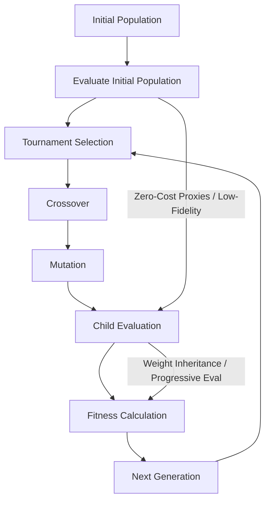

# Plano A: Hybrid architectures

## 1. Initial Population Design
- The initial population contains **pure models** of each family:
  - Transformers, Mambas, and KANs
  - Equal counts: \( N_T = N_M = N_K \)
- Example: population size = **60**
- Each individual model has:
  - **Global shared genes:** `d_model`, `depth`, `dropout`, `norm_type`, `context_len`
  - **Family-specific genes** (depending on the architecture)
- Each model is composed of **blocks**:
  - Transformers → Attention + MLP blocks  
  - Mambas → SSM blocks  
  - KANs → Group-KAN blocks

## 2. Genes

Each model genome has the following structure:

```python
model = {
  "global": {num_layers, d_model, norm_type, context_len, dropout}, # shared parameters
  "blocks": [block1, block2, ..., blockN],  # sequence of layer genes
  "family": "hybrid" or pure type
}
```

- The Blocks have local parameters wich are the ones specific to each family type:
  - Transformers: num_heads, d_ff, activation, pos_enc, attn_variant, weight_tie, attn_dropout, resid_dropout
  - Mamba: d_state, ssm_order, dt_rank, conv_kernel, activation, bias, resid_scale
  - KAN: k_groups, basis_funcs, basis_order, activation, skip_connection

## 3. Mutation
Two levels of mutation:

### A. Global Mutations
- Affect the entire model:
  - Add/remove layers (±1–3)
  - Scale model width (d_model)
  - Adjust dropout, norm_type, or context_len
  - Slightly perturb learning rate or activation

### B. Block Level Mutations
- Affect individual blocks:
  - Transformer: change heads, FF width, attention variant, or positional encoding
  - Mamba: tweak d_state, ssm_order, conv_kernel
  - KAN: modify basis_order, basis_func, or k_groups
  - Hybrid: randomly convert one block’s type (e.g., Transformer → Mamba) with probability p_convert = 0.1


## 4. Crossover Logic
- Crossover happens at the gene level.

### A. Intra-family (same type)
```python
def crossover_same_family(parentA, parentB):
    child = {}
    child["global"] = blend(parentA["global"], parentB["global"])
    child["blocks"] = crossover_blockwise(parentA["blocks"], parentB["blocks"])
    return child
```
- Numeric genes are interpolated: child[g] = α * A[g] + (1 − α) * B[g],  α ∈ [0.3, 0.7]

### B. Cross-family (different types)
- When two different families cross, the child may become hybrid. p_hybrid=0.25
- Pseudocode:
```python
def crossover_cross_family(parentA, parentB):
    child = {}
    child["global"] = blend_globals(parentA, parentB)

    if random.random() < p_hybrid:
        # Hybrid child — mix blocks
        splitA = random.randint(1, len(parentA["blocks"]) - 1)
        splitB = random.randint(1, len(parentB["blocks"]) - 1)
        child["blocks"] = parentA["blocks"][:splitA] + parentB["blocks"][splitB:]
        child["family"] = "hybrid"
    else:
        # Non-hybrid — choose dominant parent
        dominant = random.choice(["A", "B"])
        child["family"] = parentA["family"] if dominant == "A" else parentB["family"]
        child["blocks"] = copy_blocks(dominant_parent["blocks"])

    return child
```

- ATTENTION! All blocks must follow this unified interface:
```python
def forward(x, mask=None, state=None):
    # in/out: [batch, seq, d_model]
    return y, new_state
```

- Before model creation, align all blocks to the same d_model

## 5. Hybrid Design Constraints
- To make mixed stacks work:
  - All blocks must share:
    - Same d_model
    - Same normalization type
    
  - Unified residual and normalization APIs
  - Optional state handling for SSM/Mamba blocks
  - During init: block.init(d_model=child.global["d_model"], norm=child.global["norm_type"]), so we inject our global parameters into the blocks

## 6. Fitness Evaluation
- Balance accuracy and efficiency
- Ex:. fitness = 0.6 * acc_norm + 0.2 * speed_norm + 0.2 * efficiency_norm


## 7. Efficient Training
- Full training for each model is too costly, so we use proxy-based evaluation and reuse strategies to speed up fitness estimation.

### 7.1 Low-Fidelity Training
- **What it is**: Train candidates for only a few epochs or on a smaller subset of the data.
- **Purpose**: Quickly estimate performance without full training.

### 7.2 Zero-Cost Proxies
- **What it is**: Architecture-only metrics (e.g., SynFlow, SNIP, GraSP) to predict trainability
- **Purpose**: Identify promising candidates without any training.

### 7.3 Weight Inheritance
- **What it is**: Reuse parent weights for unchanged blocks in the child model.
- **Purpose**: Reduces training time and leverages previously learned representations.

### 7.4 Progressive Evaluation
- **What it is**: Start training with smaller sequence lengths or batch sizes, then scale gradually.
- **Purpose**: Filter weak models early and save computation.


## 8. Overall Workflow
### 1. Initial Population Design
- Generate a population of pure models: Transformers, Mambas, KANs.
- Assign global parameters (shared) and local parameters (block-specific).
- Example population size: 60 (≈20 per family).

### 2. Evaluate Initial Population
- Use efficient training techniques:
  - Zero-Cost Proxies → quick architecture evaluation
  - Low-Fidelity Training → few iterations on small data

- Compute initial fitness scores balancing accuracy and efficiency.

### 3. Parent Selection
- Tournament selection (e.g., size 3–5): select candidates for reproduction based on fitness.
- Ensures strong models have higher chance to pass genes while maintaining diversity.

### 4. Crossover
- Intra-family: combine genes of same type, numeric genes interpolated.
- Cross-family: produce hybrid children with probability p_hybrid = 0.25.
- Children inherit global parameters blended from parents; local parameters per block type.

### 5. Mutation
- Global mutations: affect model-wide parameters (d_model, depth, dropout, etc.)
- Block-level mutations: affect family-specific local parameters (num_heads, d_state, k_groups, etc.)
- Hybrid-specific mutations: random block type conversion with low probability (e.g., 0.1)

### 6. Child Evaluation
- Apply efficient training techniques:
  - Weight inheritance from parents for unchanged blocks
  - Progressive evaluation (start with small sequence length / batch size)
  - Optional zero-cost proxy for rapid scoring

### 7. Fitness Calculation
- Combine performance and efficiency metrics:
  - fitness = 0.6 * acc_norm + 0.2 * speed_norm + 0.2 * efficiency_norm

### 8. Next Generation
- Keep elite models (top N) to preserve best architectures
- Replace worst performers with new children
- Repeat selection → crossover → mutation → evaluation → next generation until stopping criteria (max generations, fitness plateau) 

## FLow Chart From Chatgpt

